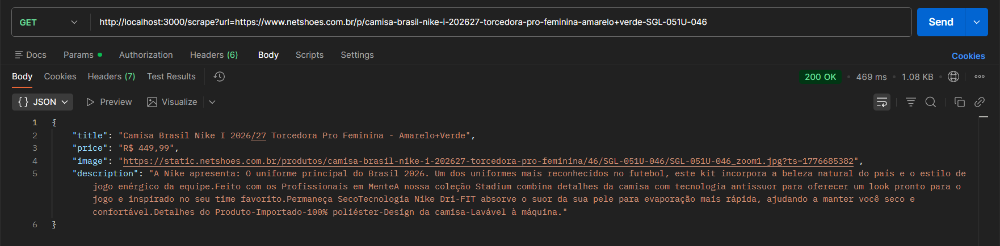
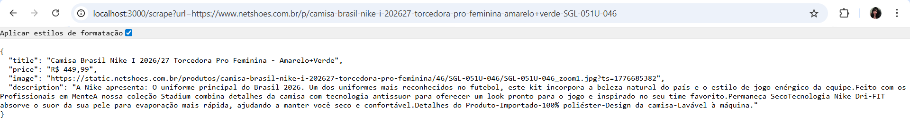

# Web Scraper Results

## Tested URL

https://www.netshoes.com.br/p/camisa-brasil-nike-i-202627-torcedora-pro-feminina-amarelo+verde-SGL-051U-046

---

## API Request

```http
GET /scrape?url=https://www.netshoes.com.br/p/camisa-brasil-nike-i-202627-torcedora-pro-feminina-amarelo+verde-SGL-051U-046
```

### Local

http://localhost:3000/scrape?url=https://www.netshoes.com.br/p/camisa-brasil-nike-i-202627-torcedora-pro-feminina-amarelo+verde-SGL-051U-046

### Docker (optional)

http://localhost:3001/scrape?url=https://www.netshoes.com.br/p/camisa-brasil-nike-i-202627-torcedora-pro-feminina-amarelo+verde-SGL-051U-046

---

## Output

```json
{
  "title": "Camisa Brasil Nike I 2026/27 Torcedora Pro Feminina - Amarelo+Verde",
  "price": "R$ 449,99",
  "image": "https://static.netshoes.com.br/produtos/camisa-brasil-nike-i-202627-torcedora-pro-feminina/46/SGL-051U-046/SGL-051U-046_zoom1.jpg?ts=1776685382",
  "description": "A Nike apresenta: O uniforme principal do Brasil 2026. Um dos uniformes mais reconhecidos no futebol, este kit incorpora a beleza natural do país e o estilo de jogo enérgico da equipe.Feito com os Profissionais em MenteA nossa coleção Stadium combina detalhes da camisa com tecnologia antissuor para oferecer um look pronto para o jogo e inspirado no seu time favorito.Permaneça SecoTecnologia Nike Dri-FIT absorve o suor da sua pele para evaporação mais rápida, ajudando a manter você seco e confortável.Detalhes do Produto-Importado-100% poliéster-Design da camisa-Lavável à máquina."
}
```

---

## Notes

- The title is extracted from the main `<h1>` element.
- The price is extracted from structured data (`saleInCents`) found in the HTML.
- The image is extracted from structured product data, with a fallback to meta tags.
- The description is extracted from the product section (`features--description`), with fallback strategies.

---

## Screenshots

### Postman



### Browser

